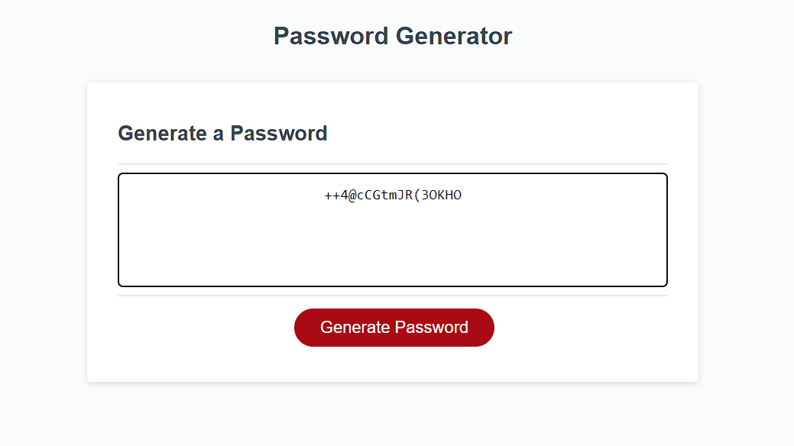

# Random Password Generator

## Table of Contents

*[What](#What)
*[Screenshot](#Screenshot)
*[What I learned](#What-I-Learned)
*[Links](#Links)

## What

This is a random password generator. A series of prompts occur asking for length and content. Then 
the generator will compile a pool of possible characters and display your choices in an alert. Finally
the password will chosen at random from the pool of possibilities and printed on the screen.

## Screenshot

## What I Learned

This challenege was pretty easy for me. The hardest part was figuring out that my variable had to be password. It 
took me about 30 mins to figure why I couldnt get the pw to show on the screen.

## Links

